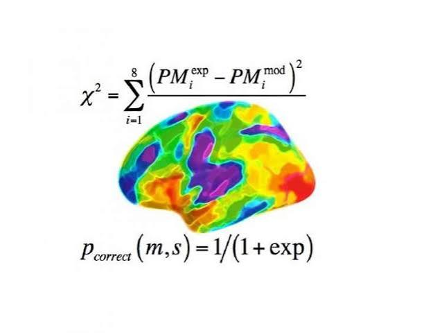
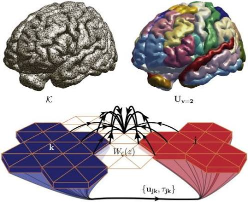

# Computational Neuroscience: Mathematical Modelling of Brain Dynamics

## Overview

Computational neuroscience combines neuroscience, mathematics, physics, and computer science to understand how biological neural systems generate complex behaviours, cognition, and brain states. <a href="reference-pdf://Ref000015">Ref000015</a> <a href="reference-url://Ref000015">🔗</a>

Mathematical modelling provides a framework to represent neurons, neural circuits, and large-scale brain networks using computational simulations. These models allow researchers to investigate mechanisms that are difficult to observe experimentally, predict neural responses, study disease-related alterations, and design biologically inspired computational systems. <a href="reference-pdf://WILSON19721">WILSON19721</a>

```see the picture```




The main objective of computational modelling is to establish a relationship between:

- Cellular mechanisms
- Synaptic interactions
- Network connectivity
- Brain dynamics
- Cognitive functions
- Behavioural outcomes


---

# 1. Levels of Computational Neuroscience Modelling

Neural models can be classified according to the biological scale they represent.

## 1.1 Single Neuron Models

Single neuron models describe the electrical behaviour of individual neurons.

The membrane potential dynamics are generally described using differential equations:

$$
C_m\frac{dV}{dt}=I_{input}-I_{ion}
$$

where:

- $C_m$ is membrane capacitance
- $V$ is membrane voltage
- $I_{input}$ represents external stimulation
- $I_{ion}$ represents ionic currents


## Hodgkin-Huxley Model

The Hodgkin-Huxley model is one of the most detailed biophysical neuron models.

It describes ion channel dynamics:

$$
C_m\frac{dV}{dt}
=
I-
g_{Na}m^3h(V-E_{Na})
-
g_Kn^4(V-E_K)
-
g_L(V-E_L)
$$


The model includes:

- Sodium channels
- Potassium channels
- Leak currents
- Action potential generation


Applications:

- Studying neuronal excitability
- Ion channel dysfunction
- Epileptic activity
- Pharmacological effects

A Python implementation of this equation is:

```python
def dVdt(V, m, h, n, I,
         Cm,
         gNa, ENa,
         gK, EK,
         gL, EL):
    """
    Hodgkin–Huxley membrane equation
    """

    INa = gNa * (m**3) * h * (V - ENa)
    IK  = gK * (n**4) * (V - EK)
    IL  = gL * (V - EL)

    dV = (I - INa - IK - IL) / Cm

    return dV
```


# 2. Reduced Neuron Models

Detailed biophysical models are computationally expensive.

Reduced models simplify neuronal dynamics while preserving important behaviour.


## Leaky Integrate-and-Fire Model

The membrane voltage evolves as:


$$
\tau_m\frac{dV}{dt}=-(V-V_{rest})+RI
$$


When voltage reaches threshold:

$$
V \geq V_{threshold}
$$

the neuron generates a spike and resets.


Advantages:

- Computationally efficient
- Suitable for large networks
- Used in artificial and biological neural simulations


---

# 3. Neural Population Models


Instead of modelling individual neurons, population models describe average activity of large groups of neurons.


## Wilson-Cowan Model

The Wilson-Cowan model describes interacting excitatory and inhibitory neuronal populations.


The equations are:

$$
\tau_E\frac{dE}{dt}
=
-E+
S(c_1E-c_2I+P)
$$


$$
\tau_I\frac{dI}{dt}
=
-I+
S(c_3E-c_4I+Q)
$$


where:

- $E$ represents excitatory population activity
- $I$ represents inhibitory population activity
- $S$ is a nonlinear activation function
- $P,Q$ are external inputs


The model can reproduce:

- Oscillations
- Bistability
- State transitions
- Neural synchronisation


Applications:

- EEG modelling
- Brain stimulation studies
- Cognitive state modelling
- Disease simulations


---

# 4. Dynamical Systems Analysis





Neural systems are nonlinear dynamical systems.

A general neural model can be represented as:


$$
\frac{dx}{dt}=F(x,\theta)
$$


where:

- $x$ represents system states
- $\theta$ represents model parameters


Important concepts:


## Fixed Points

A fixed point satisfies:


$$
F(x)=0
$$


The system remains stable if small perturbations decay.


## Stability Analysis

The Jacobian matrix is calculated:


$$
J=
\frac{\partial F}{\partial x}
$$


Eigenvalues determine stability:

- Negative real eigenvalues → stable
- Positive real eigenvalues → unstable
- Complex eigenvalues → oscillatory behaviour


---

# 5. Bifurcation Analysis


Small parameter changes can produce qualitative changes in neural behaviour.


A bifurcation occurs when:

- Stability changes
- Oscillations emerge
- Multiple states appear


Common bifurcations in neural systems:


## Hopf Bifurcation

A stable fixed point becomes oscillatory.


Applications:

- Brain rhythms
- EEG oscillations
- Epileptic transitions


## Saddle-node Bifurcation

Creation or destruction of stable states.


Applications:

- Decision making
- Working memory models


Tools:

- XPPAUT
- PyDSTool
- AUTO
- MATCONT


---

# 6. Neural Network Models


Large-scale brain simulations represent the brain as interconnected regions.

A network model consists of:


## Nodes

Represent:

- Brain regions
- Neuronal populations


## Edges

Represent:

- Anatomical connections
- Functional connectivity


The network can be represented as:


$$
A_{ij}
$$


where $A$ is the connectivity matrix.


---

# 7. Whole Brain Modelling


Whole brain models combine:

- Structural connectivity
- Neural mass models
- Time delays


A general network model:


$$
\frac{dx_i}{dt}
=
F(x_i)
+
G
\sum_j A_{ij}
H(x_j(t-\tau_{ij}))
$$


where:

- $A_{ij}$ is connectivity strength
- $\tau_{ij}$ represents communication delay
- $G$ is global coupling strength


Applications:

- Resting-state fMRI simulation
- EEG prediction
- Brain disease modelling


Software:

- The Virtual Brain (TVB)
- Neurolib
- BrainPy


---

# 8. Delay Effects in Neural Networks


Neural communication is not instantaneous.

Propagation delays arise from:

- Axonal length
- Conduction velocity
- Synaptic transmission


Delayed systems are described as:


$$
\frac{dx(t)}{dt}
=
F(x(t),x(t-\tau))
$$


Small changes in delay can influence:

- Synchronisation
- Oscillation frequency
- Network stability


Applications:

- Brain connectivity studies
- TMS response modelling
- Epilepsy research


---

# 9. Computational Tools


## Programming Languages

### Python

Used for:

- Numerical simulations
- Machine learning
- Data analysis


Libraries:

- NumPy
- SciPy
- Matplotlib
- PyTorch
- TensorFlow


## MATLAB

Used for:

- Signal processing
- Dynamical system analysis
- Neural simulations


## Simulation Frameworks

### NEURON

Used for:

- Detailed neuron models
- Ion channel simulations


### Brian2

Used for:

- Large-scale spiking networks


### NEST

Used for:

- Network simulations


### The Virtual Brain (TVB)

Used for:

- Whole-brain modelling
- Connectome-based simulations


### Neurolib

Used for:

- Neural mass modelling
- Parameter exploration
- Brain network simulations


---

# 10. Model Validation


Computational models must be compared with experimental data.


Validation methods:


## EEG Validation

Compare:

- Frequency spectrum
- Oscillation peaks
- Phase synchrony
- Functional connectivity


## fMRI Validation

Compare:

- Functional connectivity matrices
- Resting-state networks


## Behavioural Validation

Compare:

- Reaction times
- Decision making
- Cognitive performance


---

# 11. Machine Learning Integration


Modern computational neuroscience combines mechanistic models with AI.


Applications:


## Neural Parameter Estimation

Machine learning can estimate unknown biological parameters.


## Model Optimization

Optimization algorithms:

- Bayesian optimization
- Genetic algorithms
- Gradient-based methods


## Hybrid Models

Combining:

- Neural differential equations
- Deep learning
- Experimental recordings


Examples:

- Neural ODEs
- Physics-informed neural networks


---

# 12. Disease Modelling Applications


Computational models help understand neurological disorders.


## Alzheimer's Disease

Models investigate:

- Network degeneration
- Connectivity changes
- Oscillation disruption


## Parkinson's Disease

Models study:

- Basal ganglia circuits
- Dopamine effects
- Deep brain stimulation


## Epilepsy

Models investigate:

- Abnormal synchronisation
- Seizure initiation
- Propagation


## Schizophrenia

Models investigate:

- Excitation-inhibition imbalance
- Predictive coding abnormalities


---

# 13. Research Workflow


A typical computational neuroscience modelling workflow:


## Step 1: Define Biological Question

Example:

How does altered connectivity affect brain oscillations?


## Step 2: Select Model

Examples:

- Hodgkin-Huxley
- Wilson-Cowan
- Neural mass model
- Whole brain model


## Step 3: Obtain Parameters

Sources:

- Literature
- Experimental data
- Neuroimaging datasets


## Step 4: Simulation

Perform:

- Time-series simulation
- Parameter sweep
- Perturbation experiments


## Step 5: Analysis

Methods:

- Fourier analysis
- Phase synchrony
- Functional connectivity
- Bifurcation analysis


## Step 6: Biological Interpretation

Compare results with experimental observations.


---

# Conclusion

Computational neuroscience modelling provides a powerful approach to understand brain function across multiple biological scales. Mathematical models ranging from single neuron simulations to whole-brain network models allow researchers to investigate neural dynamics, cognition, and neurological disorders.

By integrating dynamical systems theory, neuroimaging, machine learning, and high-performance computing, computational neuroscience creates a bridge between biological mechanisms and observable brain behaviour.

Future developments will involve increasingly personalized brain models using individual connectomes, multimodal recordings, and artificial intelligence-driven optimization methods.