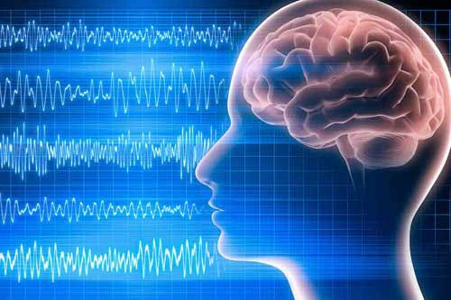
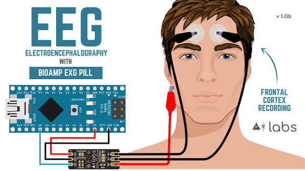

# EEG Signal Processing: From Neural Recording to Computational Analysis

## Overview

Electroencephalography (EEG) is a non-invasive neurophysiological technique used to measure electrical activity generated by neuronal populations in the brain.<a href="reference-pdf://WILSON19721">WILSON19721</a>

EEG records voltage fluctuations on the scalp produced by synchronized postsynaptic activity, primarily from pyramidal neurons in the cerebral cortex. <a href="reference-pdf://EEGLab">EEGLab</a> <a href="reference-url://EEGLab">🔗</a>

Computational EEG analysis involves:

- Signal acquisition
- Data preprocessing
- Artifact removal
- Signal transformation
- Feature extraction
- Connectivity analysis
- Machine learning
- Neural modelling

The general EEG processing pipeline is:

Raw EEG 
->
Data Import
->
Filtering
->
Artifact Removal
->
Referencing
->
Epoching
->
Feature Extraction
->
Statistical / Machine Learning Analysis
->
Neuroscientific Interpretation

---

# 1. EEG Signal Characteristics

EEG measures voltage differences between electrodes placed on the scalp.

The measured signal can be represented as:

$$
X(t)=S(t)+N(t)
$$

where:

- $X(t)$ = recorded EEG signal
- $S(t)$ = neural signal
- $N(t)$ = noise and artifacts

Common EEG frequency bands:

| Band | Frequency | Function |
|---|---|---|
| Delta | 0.5–4 Hz | Deep sleep, slow cortical activity |
| Theta | 4–8 Hz | Memory, attention |
| Alpha | 8–13 Hz | Relaxed wakefulness |
| Beta | 13–30 Hz | Active thinking, motor activity |
| Gamma | >30 Hz | Higher cognitive processing |

---

# 2. EEG Data Acquisition

## Electrode Placement

The international 10–20 system is commonly used.

Examples:

- Fp1/Fp2 → frontal region
- F3/F4 → frontal cortex
- C3/C4 → motor cortex
- P3/P4 → parietal cortex
- O1/O2 → visual cortex

## Sampling Frequency

EEG is digitized using:

$$
f_s
$$

where:

- $f_s$ = sampling frequency

Typical values:

- Clinical EEG: 250–500 Hz
- Research EEG: 500–2000 Hz

According to Nyquist theorem:

$$
f_s > 2f_{max}
$$

The sampling frequency must be at least twice the highest frequency of interest.

---

# 3. EEG Preprocessing

Raw EEG contains:

- Neural activity
- Eye movement artifacts
- Muscle artifacts
- Electrical interference
- Electrode noise

Preprocessing improves signal quality before analysis.

---

